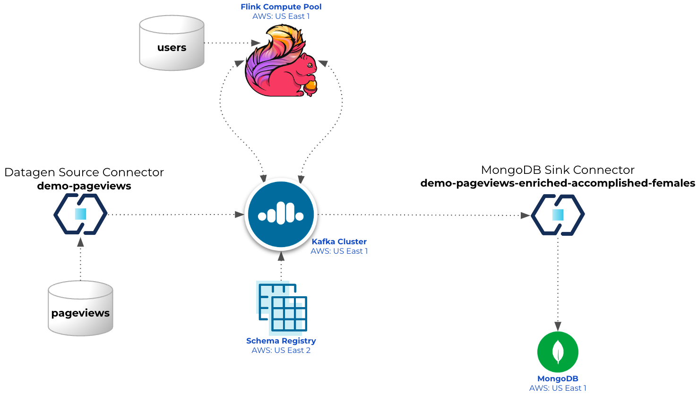

# Overview

This Confluent Cloud setup guide will help you to setup a basic cluster in your Confluent Cloud account.



# Pre-requisites
- User account on [Confluent Cloud](https://www.confluent.io/confluent-cloud/tryfree/)
- Local install of Terraform (details below)
- User account on [Atlas MongoDB](https://account.mongodb.com/account/login)

# Installation (only need to do that once)

## Install Terraform
```
brew tap hashicorp/tap
brew install hashicorp/tap/terraform
brew update
brew upgrade hashicorp/tap/terraform
```

# Provision services for the demo

## Set environment variables
- Create file `.env`
```
#!/bin/bash

# Confluent Platform
export CONFLUENT_CLOUD_API_KEY="Enter credentials here"
export CONFLUENT_CLOUD_API_SECRET="Enter credentials here"

#MongoDB Atlas
export MONGODB_ATLAS_PUBLIC_KEY="Enter credentials here"
export MONGODB_ATLAS_PRIVATE_KEY="Enter credentials here"
export MONGODB_ATLAS_PROJECT_ID="Enter MongoDB Atalas Project ID here"
export MONGODB_ATLAS_PUBLIC_IP_ADDRESS="Enter the CIDR range(s) allowed to access MongoDB (including your own public WAN IP CIDR), or allow all, for example: 0.0.0.0/0"
```

## Start Demo
- Run command: `./demo_start.sh`

## Flink Compute Pool
 - Access your Flink Compute Pool `standard_compute_pool-XXXXXXXX`
 - Make sure to select:
   - Catalog: `flink_demo_terraform-XXXXXXXX`
   - Database: `cc-demo-cluster`
 - Submit the following SQL queries (one set at a time):
```
describe extended `demo-pageviews`;

select * from `demo-pageviews`;

CREATE TABLE `demo-users` (
    `userid` STRING,
    `regionid` STRING,
    `gender` STRING,
    PRIMARY KEY (`userid`) NOT ENFORCED
);

describe extended `demo-users`;

INSERT INTO `demo-users` (`userid`, `regionid`, `gender`) VALUES ('User_1', 'Region_10', 'MALE');
INSERT INTO `demo-users` (`userid`, `regionid`, `gender`) VALUES ('User_2', 'Region_20', 'FEMALE');
INSERT INTO `demo-users` (`userid`, `regionid`, `gender`) VALUES ('User_3', 'Region_30', 'MALE');
INSERT INTO `demo-users` (`userid`, `regionid`, `gender`) VALUES ('User_4', 'Region_40', 'FEMALE');
INSERT INTO `demo-users` (`userid`, `regionid`, `gender`) VALUES ('User_5', 'Region_50', 'MALE');
INSERT INTO `demo-users` (`userid`, `regionid`, `gender`) VALUES ('User_6', 'Region_60', 'FEMALE');
INSERT INTO `demo-users` (`userid`, `regionid`, `gender`) VALUES ('User_7', 'Region_70', 'MALE');
INSERT INTO `demo-users` (`userid`, `regionid`, `gender`) VALUES ('User_8', 'Region_80', 'FEMALE');
INSERT INTO `demo-users` (`userid`, `regionid`, `gender`) VALUES ('User_9', 'Region_90', 'MALE');

select * from `demo-users`;

CREATE TABLE `demo-pageviews-enriched` (
    `userid` STRING,
    `regionid` STRING,
    `gender` STRING,
    `pageid` INTEGER,
    `viewtime` TIMESTAMP(3),
    WATERMARK FOR `viewtime` AS `viewtime` - INTERVAL '1' MINUTES,
    PRIMARY KEY (`userid`) NOT ENFORCED
);

describe extended `demo-pageviews-enriched`;

INSERT INTO `demo-pageviews-enriched` (`userid`, `regionid`, `gender`, `pageid`, `viewtime`)
SELECT
   p.`userid`,
   u.`regionid`,
   u.`gender`,
   CAST(REGEXP_EXTRACT(p.`pageid`, '.*?(\d+)', 1) as INTEGER),
   p.`$rowtime`
FROM
   `demo-pageviews` as p
LEFT JOIN `demo-users` AS u
ON
   p.`userid` = u.`userid`;

CREATE TABLE `demo-accomplished-females` (
    `userid` STRING,
    `regionid` STRING,
    `gender` STRING,
    `viewtime` TIMESTAMP(3),
    `sum_pageid` INTEGER,
    WATERMARK FOR `viewtime` AS `viewtime` - INTERVAL '1' MINUTES
);

describe extended `demo-accomplished-females`;

INSERT INTO `demo-accomplished-females` (`userid`, `regionid`, `gender`, `viewtime`, `sum_pageid`)
SELECT
    `userid`,
    `regionid`,
    `gender`,
    `viewtime`,
    SUM(`pageid`)
FROM
    TABLE(
        TUMBLE(TABLE `demo-pageviews-enriched`, DESCRIPTOR(`viewtime`), INTERVAL '10' MINUTES)
    )
GROUP BY `userid`, `regionid`, `gender`, `viewtime`
HAVING
    SUM(`pageid`) >= 100
    AND `gender` = 'FEMALE';
```

## Add MongoDB + Sink Connector
- Run command: `./demo_mongo.sh`

## Stop Demo
- Run command: `./demo_stop.sh`

# Demo details
1. Create Environment on Confluent Cloud (`https://confluent.cloud/`) named `flink_demo_terraform-XXXXXXXX` (where `XXXXXXXX` is a random hexadecimal value, e.g., `a492d37e`)
2. Create Schema Registry on AWS us-east-2
3. Create Basic/single-zone Kafka cluster on AWS us-east-1 named `cc-demo-cluster`
4. Create Flink Compute Pool `standard_compute_pool-XXXXXXXX`
5. Create DataGen source connector:
- `DSC_pageviews` sourcing data to the topic `demo-pageviews`, example:
```
{
  "viewtime": 1341,
  "userid": "User_6",
  "pageid": "Page_38"
}

Schema:
{
  "connect.name": "ksql.pageviews",
  "fields": [
    {
      "name": "viewtime",
      "type": "long"
    },
    {
      "name": "userid",
      "type": "string"
    },
    {
      "name": "pageid",
      "type": "string"
    }
  ],
  "name": "pageviews",
  "namespace": "ksql",
  "type": "record"
}
```
6. Create MongoDB `M0` (free tier) cluster on AWS us-east-1 named `terraformFlinkDemo` (IMPORTANT: Only one free-tier cluster is allowed per Atlas account)
7. Add entry to the Network Access tab (Atlas):
 - IP Address: 0.0.0.0/0 (or as set on env variable MONGODB_ATLAS_PUBLIC_IP_ADDRESS)
 - Comment: cidr block for terraformFlinkDemo
8. Add entry to the Database Access tab (Atlas):
 - User name: mongodb-demo
 - Password: 16 chars randomly generated
   - Type `terraform output -json` after running `terraform apply` to view the password and MongoDB connection string
 - Auth Method: SCRAM
 - MongoDB Roles:
   - readWrite@confluent_demo
   - dbAdmin@confluent_demo
 - Resources: All resources
9. MongoDB Database named `confluent_flink_demo`
10. Create MongoDB Atlas Sink connector named `confluent-mongodb-sink`
 - A new collection will be created to the MongoDB database named `confluent_demo.accomplished_female_readers`, see example of document below (from topic `demo-accomplished-females`)
 ```
_id: 63fcedd6f11f041d35ce6f88
PAGEID: "Page_83"
REGIONID: "Region_1"
GENDER: "FEMALE"
 ```
11. The Terraform code will also create Service Accounts, ACLs and API Keys

# Terraform files
- `vars.tf`: Main system variables (change it as needed)
- `providers.tf`:
  - confluentinc/confluen
  - mongodb/mongodbatlas
  - hashicorp/external (To read env variables)
- `cflt_cloud.tf`: 
  - Confluent Cloud Environment
  - Schema Registry
  - Apache Kafka Cluster
  - Service Accounts (app_manager, sr, clients)
  - Role Bindings (app_manager, sr, clients)
  - Credentials / API Keys (app_manager, sr, clients)
- `cflt_connectors.tf`:
  - Service Accounts (Connectors)
  - Access Control List
  - Credentials / API Keys
  - Create Kafka topics for the DataGen Connectors
  - DataGen Connectors
- `mongodb.tf`:
  - Create free tier cluster (only one allowed per Atlas account)
  - Whitelist IP Address
  - Create DB user
  - MongoDB Sink Connector
