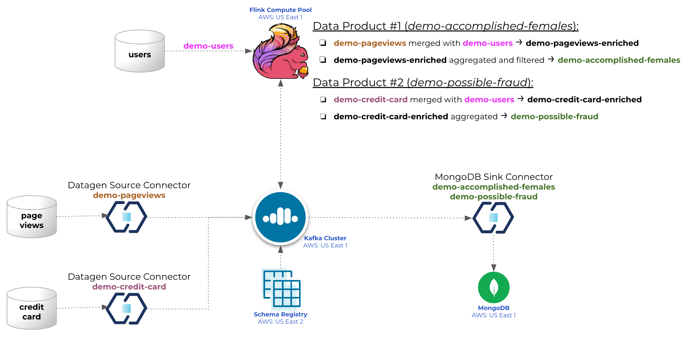

# Overview

This is a demo to try out Flink on Confluent Cloud.

It will create two data products and have then sunk to an Atlas MongoDB:
 - `demo-possible-fraud`:
    - merge of a non-transactional table `demo-users` with a transactional one `demo-credit-card`
    - list all cases where the sum of all transactions within a given timeframe is greater than the average credit card transaction for a given user
 - `demo-accomplished-females`:
    - merge of a non-transactional table `demo-users` with a transactional one `demo-pageviews`
    - list all female readers that has read more than a given number of pages within a given timeframe



# Pre-requisites
- User account on [Confluent Cloud](https://www.confluent.io/confluent-cloud/tryfree)
- User account on [Atlas MongoDB](https://account.mongodb.com/account/login)
- Local install of [Terraform](https://www.terraform.io) (details below)
- Local install of [jq](https://jqlang.github.io/jq/download) (details below)

# Installation (only need to do that once)

## Install Terraform
```
brew tap hashicorp/tap
brew install hashicorp/tap/terraform
brew update
brew upgrade hashicorp/tap/terraform
```

## Install jq
```
brew install jq
```

# Provision services for the demo

## Set environment variables
- Create file `.env`
```
#!/bin/bash

# Confluent Platform
export CONFLUENT_CLOUD_API_KEY="Enter credentials here"
export CONFLUENT_CLOUD_API_SECRET="Enter credentials here"

#MongoDB Atlas
export MONGODB_ATLAS_PUBLIC_KEY="Enter credentials here"
export MONGODB_ATLAS_PRIVATE_KEY="Enter credentials here"
export MONGODB_ATLAS_PROJECT_ID="Enter MongoDB Atalas Project ID here"
export MONGODB_ATLAS_PUBLIC_IP_ADDRESS="Enter the CIDR range(s) allowed to access MongoDB (including your own public WAN IP CIDR), or allow all, for example: 0.0.0.0/0"
```

## Start Demo
- Run command: `./demo_start.sh`

## Flink Compute Pool
 - Access Confluent Cloud WebUI: https://confluent.cloud/login
 - Access your Environment: `flink_demo_terraform-XXXXXXXX`
 - Access your Flink Compute Pool: `standard_compute_pool-XXXXXXXX`
 - Click `Open SQL workspace`
 - Make sure to select:
   - Catalog: `flink_demo_terraform-XXXXXXXX`
   - Database: `cc-demo-cluster`
 - Submit the following SQL queries (one at a time):
```
-- *****************************
-- Create non-transaction table
-- ****************************

--------------------------------------------------------
-- View demo-pageviews table (from topic with same name)
--------------------------------------------------------
describe extended `demo-pageviews`;

select * from `demo-pageviews`;

---------------------------------------------------------------
-- Create table demo-users (topic with same name to be created)
---------------------------------------------------------------
CREATE TABLE `demo-users` (
  `userid` STRING,
  `full_name` STRING,
  `regionid` STRING,
  `gender` STRING,
  `avg_credit_spend` DOUBLE
) WITH (
  'changelog.mode' = 'retract'
);

describe extended `demo-users`;

----------------------------------------------------------------------
-- Populate table demo-users (see new messages published in the topic)
----------------------------------------------------------------------
INSERT INTO `demo-users` (`userid`, `full_name`, `regionid`, `gender`,  `avg_credit_spend`) VALUES
  ('User_1', 'Blake Lambert', 'Region_10', 'MALE', 2650.0),
  ('User_2', 'Olivia Anderson', 'Region_20', 'FEMALE', 5721.0),
  ('User_3', 'Evan Hughes', 'Region_30', 'MALE', 4822.0),
  ('User_4', 'Sonia Marshall', 'Region_40', 'FEMALE', 2629.0),
  ('User_5', 'Benjamin Stewart', 'Region_50', 'MALE', 1455.0),
  ('User_6', 'Caroline Coleman', 'Region_60', 'FEMALE', 3999.0),
  ('User_7', 'Oliver Chapman', 'Region_70', 'MALE', 40233.0),
  ('User_8', 'Rose Skinner', 'Region_80', 'FEMALE', 4611.0),
  ('User_9', 'Bernadette Cameron', 'Region_90', 'OTHER', 5623.0);

select * from `demo-users`;

-- ******************************************
-- Data Product #1: demo-accomplished-females
-- ******************************************

----------------------------------------------------------------------------
-- Create table demo-pageviews-enriched (topic with same name to be created)
----------------------------------------------------------------------------
CREATE TABLE `demo-pageviews-enriched` (
  `userid` STRING,
  `full_name` STRING,
  `regionid` STRING,
  `gender` STRING,
  `pageid` INTEGER,
  `viewtime` TIMESTAMP(3),
  WATERMARK FOR `viewtime` AS `viewtime` - INTERVAL '1' MINUTES
) WITH (
  'changelog.mode' = 'retract'
);

describe extended `demo-pageviews-enriched`;

---------------------------------------------------------------------------------
-- Merge tables demo-pageviews (transactional) and demo-users (non-transactional) 
---------------------------------------------------------------------------------
INSERT INTO `demo-pageviews-enriched` (`userid`, `full_name`, `regionid`, `gender`, `pageid`, `viewtime`)
SELECT
  p.`userid`,
  u.`full_name`,
  u.`regionid`,
  u.`gender`,
  CAST(REGEXP_EXTRACT(p.`pageid`, '.*?(\d+)', 1) as INTEGER),
  p.`$rowtime`
FROM
  `demo-pageviews` as p
LEFT JOIN `demo-users` AS u
ON
  p.`userid` = u.`userid`;

select * from `demo-pageviews-enriched`;

------------------------------------------------------------------------------
-- Create table demo-accomplished-females (topic with same name to be created)
------------------------------------------------------------------------------
CREATE TABLE `demo-accomplished-females` (
  `userid` STRING,
  `full_name` STRING,
  `regionid` STRING,
  `gender` STRING,
  `viewtime` TIMESTAMP(3),
  `sum_pageid` INTEGER,
  WATERMARK FOR `viewtime` AS `viewtime` - INTERVAL '1' MINUTES
) WITH (
  'changelog.mode' = 'retract'
);

describe extended `demo-accomplished-females`;

------------------------------------------------------------------------
-- Populate table demo-accomplished-females (data aggregation + filters)
------------------------------------------------------------------------
INSERT INTO `demo-accomplished-females`
SELECT
  `userid`,
  `full_name`,
  `regionid`,
  `gender`,
  `window_start`,
  SUM(`pageid`)
FROM
  TABLE(
    TUMBLE(TABLE `demo-pageviews-enriched`, DESCRIPTOR(`viewtime`), INTERVAL '1' MINUTES)
  )
GROUP BY `userid`, `full_name`, `regionid`, `gender`, `window_start`
HAVING
  SUM(`pageid`) >= 500
  AND `gender` = 'FEMALE';

-------------------------------------------------------------------------------------------------------------------------------------
-- Query table demo-accomplished-females to see the events flowing through, then continue with the rest of the demo (sink to MongoDB)
-------------------------------------------------------------------------------------------------------------------------------------
select * from `demo-accomplished-females`;

-- ************************************
-- Data Product #2: demo-possible-fraud
-- ************************************

----------------------------------------------------------------------------
-- Create table demo-credit-card-enriched (topic with same name to be created)
----------------------------------------------------------------------------
CREATE TABLE `demo-credit-card-enriched` (
  `userid` STRING,
  `full_name` STRING,
  `regionid` STRING,
  `gender` STRING,
  `amount` DOUBLE,
  `avg_credit_spend` DOUBLE,
  `transaction_id` BIGINT,
  `credit_card_last_four` STRING,
  `timestamp` TIMESTAMP(3),
  WATERMARK FOR `timestamp` AS `timestamp` - INTERVAL '1' MINUTES
) WITH (
  'changelog.mode' = 'retract'
);

describe extended `demo-credit-card-enriched`;

----------------------------------------------------------------------------------
-- Merge tables demo-credit-card (transactional) and demo-users (non-transactional) 
----------------------------------------------------------------------------------
INSERT INTO `demo-credit-card-enriched` (`userid`, `full_name`, `regionid`, `gender`, `amount`, `avg_credit_spend`, `transaction_id`, `credit_card_last_four`, `timestamp`)
SELECT
  c.`userid`,
  u.`full_name`,
  u.`regionid`,
  u.`gender`,
  c.`amount`,
  u.`avg_credit_spend`,
  c.`transaction_id`,
  c.`credit_card_last_four`,
  c.`timestamp`
FROM
  `demo-credit-card` as c
LEFT JOIN `demo-users` AS u
ON
  c.`userid` = u.`userid`;

select * from `demo-credit-card-enriched`;

------------------------------------------------------------------------
-- Create table demo-possible-fraud (topic with same name to be created)
------------------------------------------------------------------------
CREATE TABLE `demo-possible-fraud` (
  `userid` STRING,
  `full_name` STRING,
  `regionid` STRING,
  `gender` STRING,
  `timestamp` TIMESTAMP(3),
  `sum_amount` DOUBLE,
  `max_avg_credit_spend` DOUBLE,
  WATERMARK FOR `timestamp` AS `timestamp` - INTERVAL '1' MINUTES
) WITH (
  'changelog.mode' = 'retract'
);

describe extended `demo-possible-fraud`;

-------------------------------------------------------------------------------------------------
-- Populate table demo-possible-fraud (If sum of amount if greater than average credit card spend)
-------------------------------------------------------------------------------------------------
INSERT INTO `demo-possible-fraud`
SELECT
  `userid`,
  `full_name`,
  `regionid`,
  `gender`,
  `window_start`,
   SUM(`amount`),
   MAX(`avg_credit_spend`)
FROM
  TABLE(
    TUMBLE(TABLE `demo-credit-card-enriched`, DESCRIPTOR(`timestamp`), INTERVAL '30' SECONDS)
  )
GROUP BY `userid`, `full_name`, `regionid`, `gender`, `window_start`
HAVING
  SUM(`amount`) > MAX(`avg_credit_spend`);

select * from `demo-possible-fraud`;
```

## Add MongoDB + Sink Connector
- Run command: `./demo_mongo.sh`

## Stop Demo
- Run command: `./demo_stop.sh`

# Demo details
1. Create Environment on Confluent Cloud (`https://confluent.cloud/`) named `flink_demo_terraform-XXXXXXXX` (where `XXXXXXXX` is a random hexadecimal value, e.g., `a492d37e`)
2. Create Schema Registry on AWS us-east-2
3. Create Basic/single-zone Kafka cluster on AWS us-east-1 named `cc-demo-cluster`
4. Create Flink Compute Pool `standard_compute_pool-XXXXXXXX`
5. Create DataGen source connectors:
- `DSC_pageviews` sourcing data to the topic `demo-pageviews`, example:
```
{
  "viewtime": 1341,
  "userid": "User_6",
  "pageid": "Page_38"
}

Schema:
{
  "connect.name": "ksql.pageviews",
  "fields": [
    {
      "name": "viewtime",
      "type": "long"
    },
    {
      "name": "userid",
      "type": "string"
    },
    {
      "name": "pageid",
      "type": "string"
    }
  ],
  "name": "pageviews",
  "namespace": "ksql",
  "type": "record"
}
```
- `DSC_credit_card` sourcing data to the topic `demo-credit-card`, example:
```
{
  "timestamp": 1697881233780,
  "userid": "User_7",
  "amount": 386.90416643284493,
  "transaction_id": 6079,
  "credit_card_last_four": "8901"
}

Schema:
{
  "connect.name": "datagen.credit_card",
  "fields": [
    {
      "name": "timestamp",
      "type": {
        "connect.name": "org.apache.kafka.connect.data.Timestamp",
        "connect.version": 1,
        "logicalType": "timestamp-millis",
        "type": "long"
      }
    },
    {
      "name": "userid",
      "type": "string"
    },
    {
      "name": "amount",
      "type": "double"
    },
    {
      "name": "transaction_id",
      "type": "long"
    },
    {
      "name": "credit_card_last_four",
      "type": "string"
    }
  ],
  "name": "credit_card",
  "namespace": "datagen",
  "type": "record"
}
```
6. Create MongoDB `M0` (free tier) cluster on AWS us-east-1 named `terraformFlinkDemo` (IMPORTANT: Only one free-tier cluster is allowed per Atlas account)
7. Add entry to the Network Access tab (Atlas):
 - IP Address: 0.0.0.0/0 (or as set on env variable MONGODB_ATLAS_PUBLIC_IP_ADDRESS)
 - Comment: cidr block for terraformFlinkDemo
8. Add entry to the Database Access tab (Atlas):
 - User name: mongodb-demo
 - Password: 16 chars randomly generated
   - Type `terraform output -json` after running `terraform apply` to view the password and MongoDB connection string
 - Auth Method: SCRAM
 - MongoDB Roles:
   - readWrite@confluent_demo
   - dbAdmin@confluent_demo
 - Resources: All resources
9. MongoDB Database named `confluent_flink_demo`
10. Create MongoDB Atlas Sink connector named `confluent-mongodb-sink`

&emsp;Two new collections will be created to the MongoDB database:

&emsp;&emsp;a) `confluent_flink_demo.accomplished_female_readers`, see example of document below (from topic `demo-accomplished-females`)
```
_id: 65326651fca84544107f3ffa
userid: "User_8"
regionid: "Region_80"
gender: "FEMALE"
viewtime: 2023-10-20T11:22:00.000+00:00
sum_pageid: 527
```
&emsp;&emsp;b) `confluent_flink_demo.demo-possible-fraud`, see example of document below (from topic `demo-possible-fraud`)
```
_id: 6533a6a8a0bad77e82c5a54e
userid: "User_3"
full_name: "Evan Hughes"
regionid: "Region_30"
gender: "MALE"
timestamp: 2023-10-21T09:39:30.000+00:00
sum_amount: 5650.388958945722
max_avg_credit_spend: 3675
```
11. The Terraform code will also create Service Accounts, ACLs and API Keys

# Terraform files
- `vars.tf`: Main system variables (change it as needed)
- `providers.tf`:
  - confluentinc/confluen
  - mongodb/mongodbatlas
  - hashicorp/external (To read env variables)
- `cflt_cloud.tf`: 
  - Confluent Cloud Environment
  - Schema Registry
  - Apache Kafka Cluster
  - Service Accounts (app_manager, sr, clients)
  - Role Bindings (app_manager, sr, clients)
  - Credentials / API Keys (app_manager, sr, clients)
- `cflt_connectors.tf`:
  - Service Accounts (Connectors)
  - Access Control List
  - Credentials / API Keys
  - Create Kafka topics for the DataGen Connectors
  - DataGen Connectors
- `mongodb.tf`:
  - Create free tier cluster (only one allowed per Atlas account)
  - Whitelist IP Address
  - Create DB user
  - MongoDB Sink Connector
